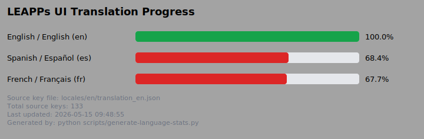

# Translation Stats

These numbers are generated from the **UI** `translation_xx.json` files under `locales/`.
Empty or whitespace-only values in a locale file count as **untranslated**.

**Note:** The following translation locale(s) exist under `locales/` but are not yet listed in `LANGUAGE_NAMES` in [`scripts/generate-language-stats.py`](../scripts/generate-language-stats.py): 
`de` 
Add an English name and autonym tuple for each so the chart labels stay correct.

